# **MODBUS TCP**

    The Quality Inspection (QI) system can share 128 bytes of data with the Modbus master 
    controller to exchange information.The start address of the holding register can be set 
    according to the master’s requirements with the port and IP address.

## **CONFIGURE WITH SIEMENS PLC**

### **1. Setup Quality Inspection**

1.Open the settings window of the QI app.

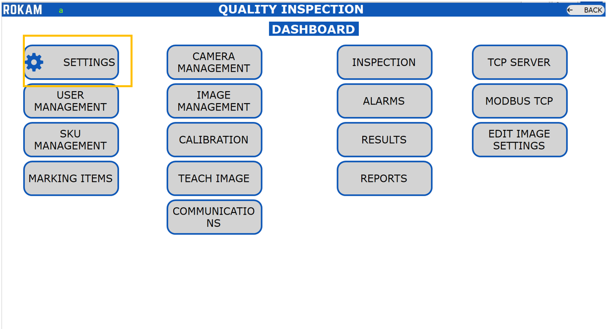

2.Enable Modbus TCP and set the IP address, Port No, Start Address.

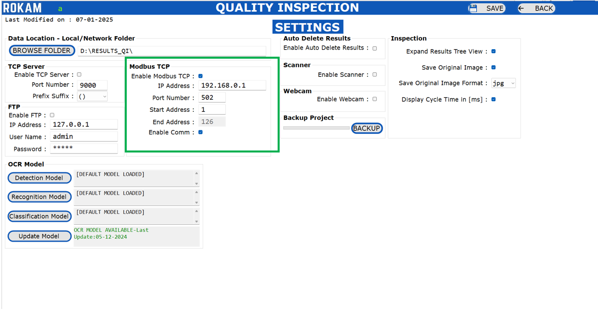

**Enable Modbus TCP -** Enable/Disable the Modbus TCP client in the system.

**Port No           -** Default value is 502, But it can change based on the master configuration.

**IP Address        -** Set the IP address of the master controller (PLC). Make sure that both master and slave in same network.

**Start Address     -** *Holding register* start address. For siemens PC, it is recommended to keep the value as 1. It can be adjusted based on the master controller settings.

**End Address       -** The value will be 126byte from the starting character.

**Enable Comm       -** Enable the Modbus communication to data transmission from Qi application to Modbus TCP master controller.

### **2. Setup the Siemens PLC**

    Siemens S71200 PLC example has taken for developing this manual. Siemens can communicate 
    over Modbus TCP through Profinet Port. 

1.Open the TIA Portal project.

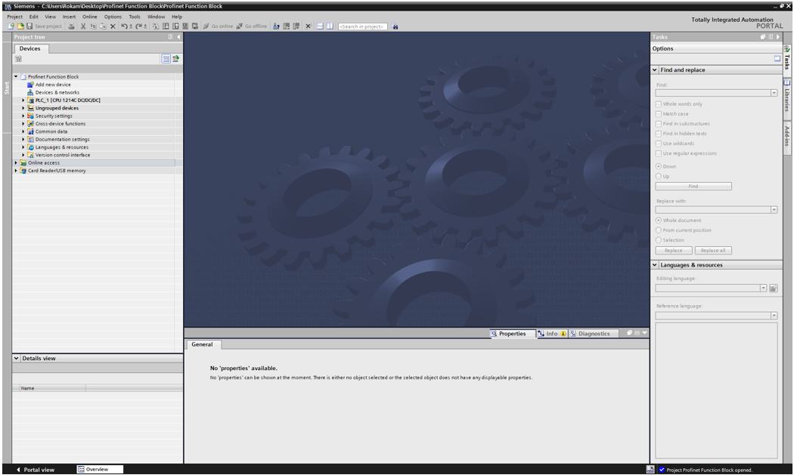

2.Goto program block and add the “MB_SERVER” block in the program.

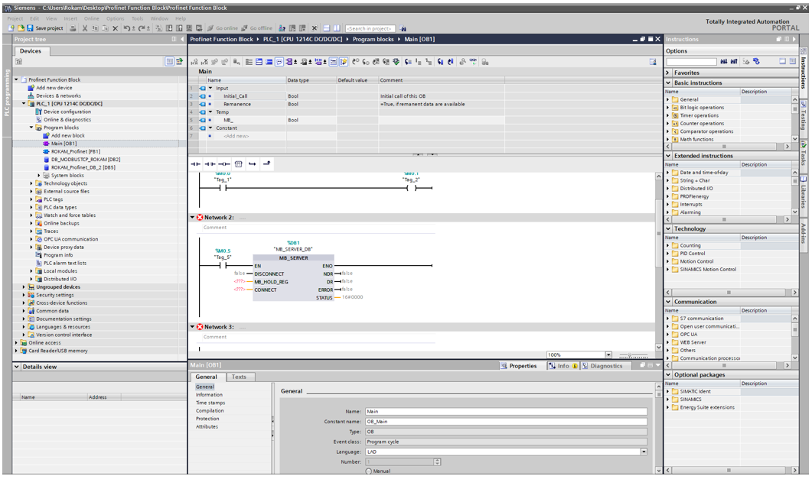

3.Add new data block for the “MB_SERVER” as like below.

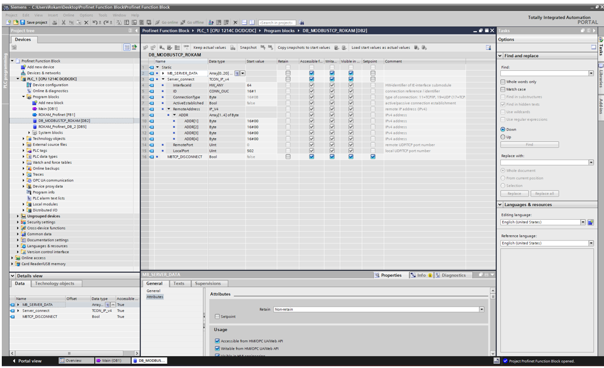

4.Assign the label to “MB_SERVER” block. Refer Below Images.

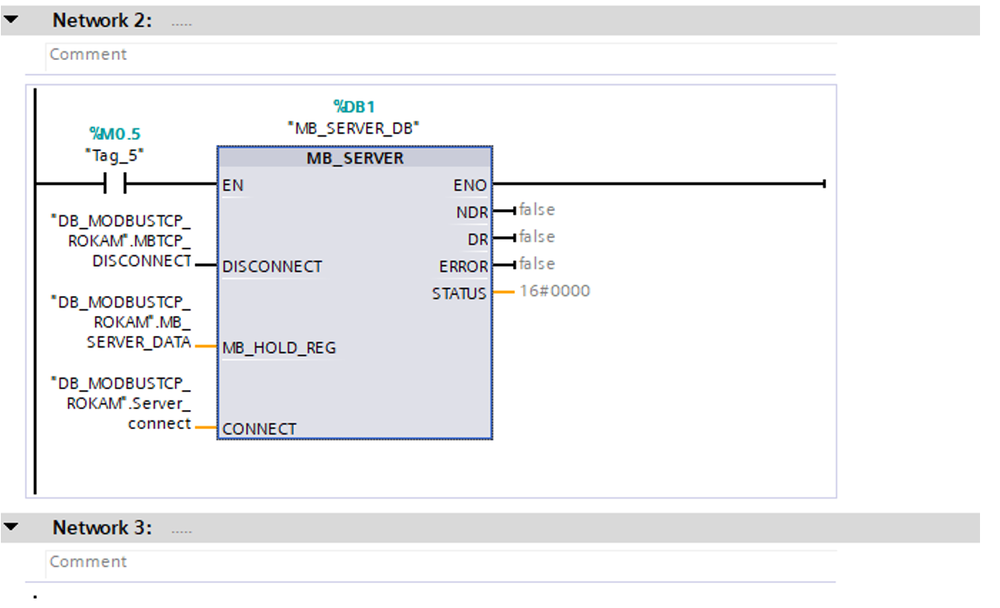

**EN:** Enable the MB_Server Instruction.

**DISCONNECT:** The instruction "MB_SERVER" enters into a passive connection with a partner module, which means the server responds to a TCP connection request from each requesting IP address. You can use this parameter to control when a connection request is accepted:

    0: A passive connection is established when there is no communications connection.

    1: Initialization of the connection termination. If the input is set, no other operations are executed.
    The value 7003 is output at the STATUS parameter after successful connection termination.

**MB_HOLD_REG:** Pointer to the Modbus holding register of the "MB_SERVER" instruction: Use a global data block with standard access as holding register. The holding register contains the values that may be accessed by a Modbus client using the Modbus functions 3 (read), 6 (write) and 16 (read).

**CONNECT:** Set the “Server_Connect” DB value as explained in Step 4.

**NDR:** New Data Ready. “0” Means No new data_ “1” means New data written by the Modbus client.

**DR:** Data Read. “0” Means – No data read and “1” means Data read by the Modbus client.

**ERROR:** If an error occurs during the call of the "MB_SERVER" instruction, the output of the ERROR parameter is set to TRUE. Detailed information about the cause of the problem is indicated by the STATUS parameter.

**STATUS:** Error code of the instruction. Refer below Table.

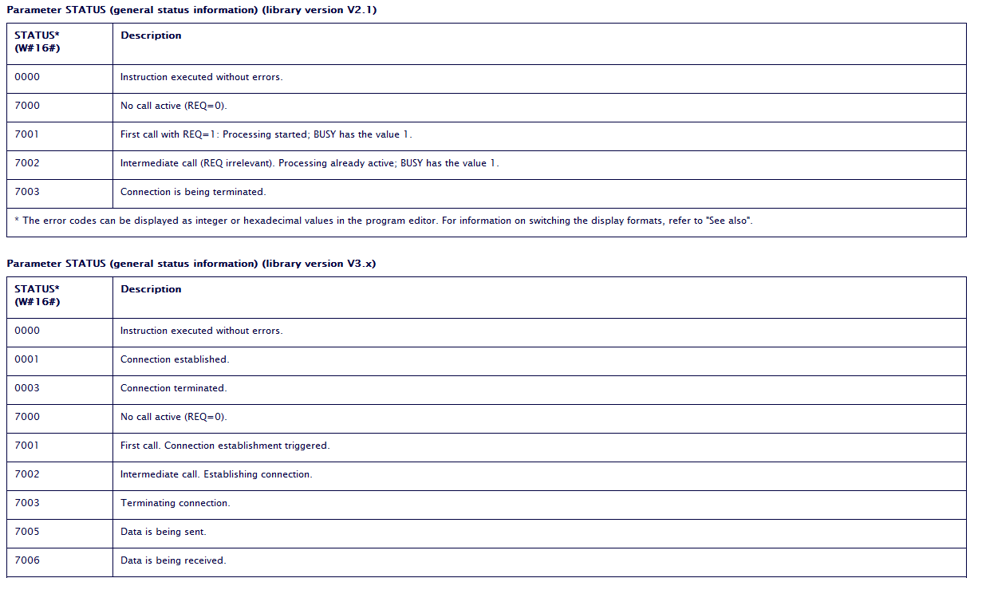

5.Setup the “MB Server” Block parameter.

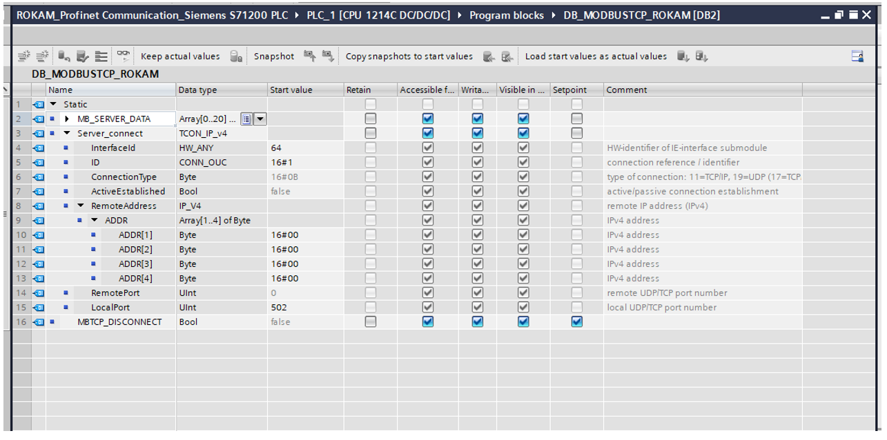
Set the “Server Connect” Parameter.

**Interface ID      :** HW-Idenfier of the IE-Interface Submodule - Set value as 64. Refer Below Image

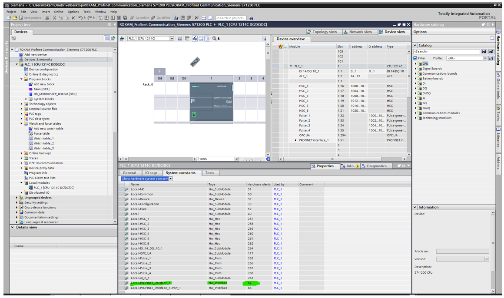

**ID                :** Connection Identifier, Default ID is set to 1. If multiple Modbus slaves are connected to the controller, this value needs to be changed according to the connection.

**Connection Type   :**  Set as 11.

**Active Established:** Set as False.

**Remote Address    :** Set remote IP address as 0.0.0.0 in case only one modbus slave is connected, If there are multiple devices then assign the IP address in Hex format.

**Remote Port       :** Set as 0.

**Local Port No     :** Start value=502. The number of the IP port defines which IP port is monitored for connection requests of the Modbus client.
The following TCP port numbers must not be used for the passive connection of the **"MB_SERVER"** instruction: 20, 21, 25, 80, 102, 123, 5001, 34962, 34963 and 34964.

Setup is completed in QI and PLC, Please establish the communication and check the Holding register data after enabling the Monitor all.

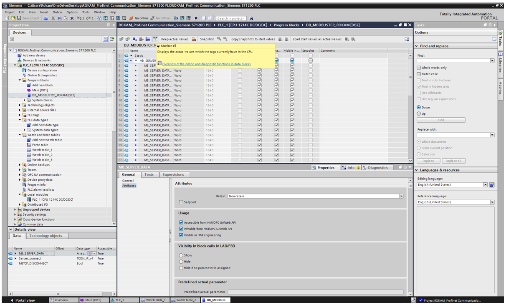

Handshaking of Registers between the PLC and ModbusTCP in the Quality Inspection Application is explained below.

First 10Bytes of data is used was allocated as below table. 

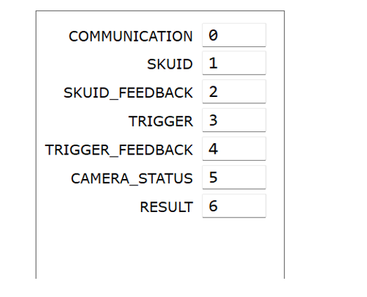

**Communication    :** Heartbeat Signal to PLC, Every 5sec, the value will be changed from 1 to 2.

**SKU ID           :** In QI application max 999 Job variant can be set, This parameter help to select these SKU ID. For example, if you required to change the SKU ID from 1 to 100, You can directly push the 100 value over here.

**SKU ID FEEDBACK  :** Once the SKU is successfully loaded, then the SKUID_FEEDBACK register will be written with the same ‘SKUID Value’ by the Application

**TRIGGER          :** Trigger the loaded SKU ID. Push 01 to trigger the camera.

**TRIGGER FEEDBACK :** Once the Application read this register TRIGGER with value ‘1’, then the TRIGGER Register will be reset with number ‘0’ and TRIGGER_FEEDBACK will be written as ‘1’. The PLC will receive the TRIGGER_FEEDBACK and reset the Value with ‘0’.

**CAMERA STATUS    :** The CAMERA_STATUS Register value will be written by the Application. The PLC will monitor this camera status and perform the process steps as per their automation cycle. 

    Register Value as 3 => if the inspection is in progress. 
    Register Value as 2 => ready to take the trigger 
    Register Value as 0 => camera is not yet ready

**RESULT           :** The RESULT Register value will be written by the Application. The PLC will monitor this result and perform the process steps as per their automation cycle.

    Register Value as 2 => if the Result is FAIL. 
    Register Value as 1 => if the Result is PASS. 
    Register Value as 0 => if the Result is Not Yet Ready.

The Result data will be pushed in 11th register.

**Location of MODBUS Registers:** Register Location: Start Address [Refer Settings] + Register Location

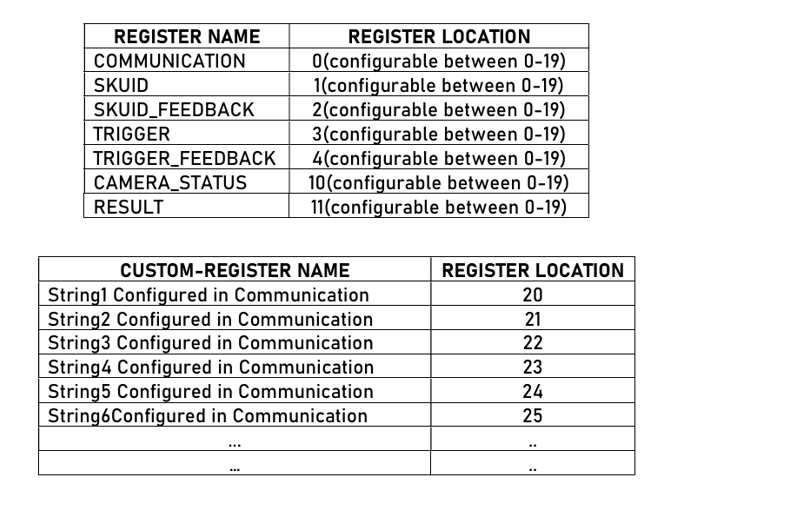

You can set the required result of each SKU ID in the Communication Window of QI. For setting the result, follow the below steps.

    1.Click on Communication and go to setup window.

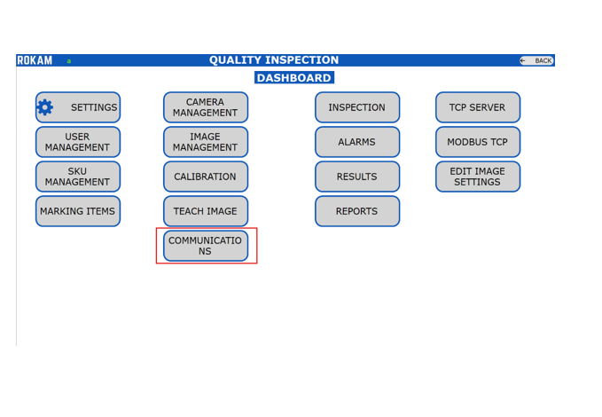

    2.Select the SKU ID and select the communication string of the each tool from the list.

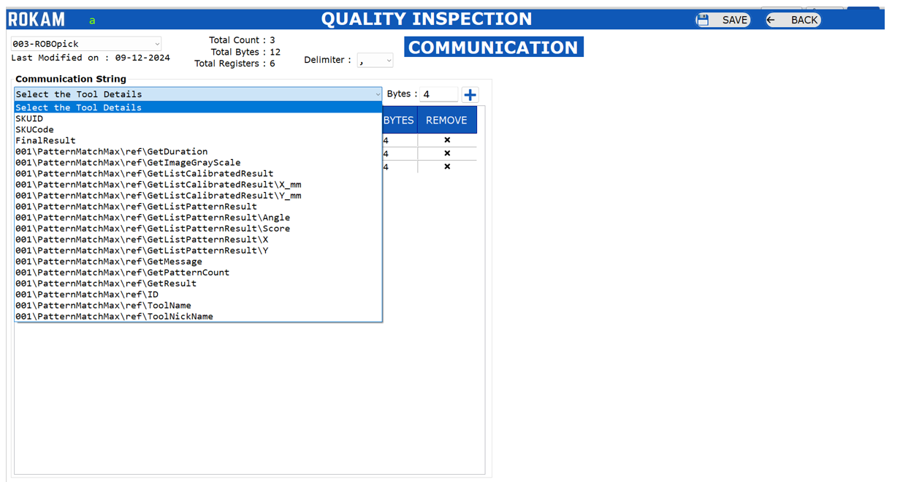

    3.Save the setting and go back.

After Each successful trigger from PLC, The QI Application will send the result string to PLC. 